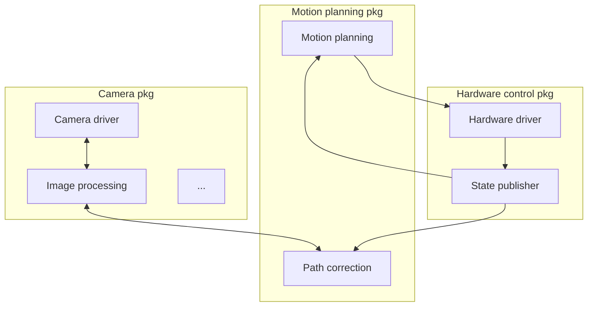

# Nodes
A node is a subprogram in the application, responsible for only one thing.

A package contains multiple nodes.
For example, a camera package can contain camera driver node, image processing node, etc.

Nodes are combined into a graph, and nodes communicate with each other through topics, services, and parameters.




### Commands
```bash
# enable env
direnv allow

# create python pkg
ros2 pkg create node_py_pkg --build-type ament_python --dependencies rclpy
# create c++ pkg
ros2 pkg create node_cpp_pkg --build-type ament_cmake --dependencies rclcpp

# build all pkgs
colcon build
# build one pkg
colcon build --packages-select node_py_pkg

# run pkg
ros2 run node_py_pkg hello_world_node
```