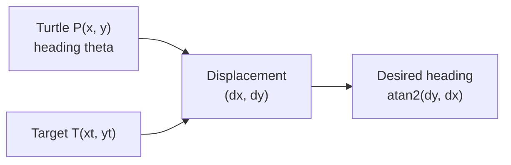
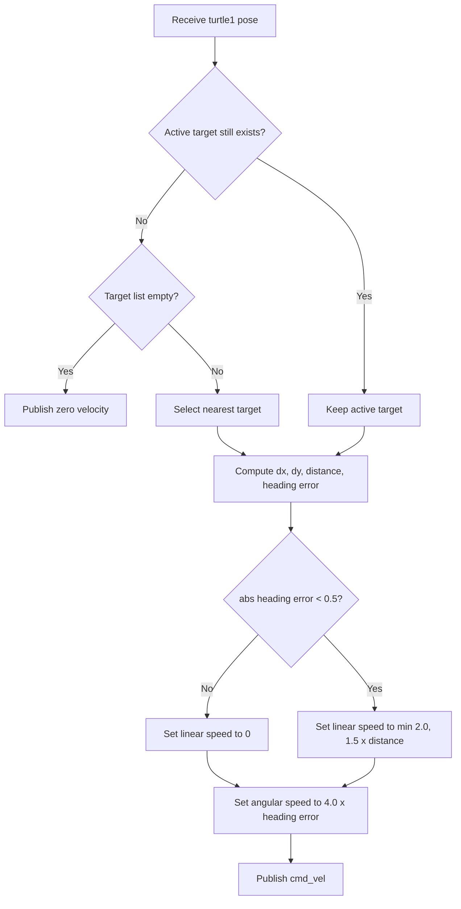

# Chasing Turtle

A ROS 2 turtlesim exercise implemented in both C++ and Python. The project creates
random target turtles, drives `turtle1` toward them, removes targets when they are
reached, and publishes the current target registry for other nodes to consume.

Run either the C++ implementation or the Python implementation, not both at the
same time. They use the same node names, topics, and turtlesim services.

## Packages

- `chasing_interfaces`: shared `Target` and `TargetPositions` messages.
- `chasing_cpp_pkg`: C++ spawner, collector, and chaser nodes.
- `chasing_py_pkg`: Python implementation of the same nodes.

## Nodes and ROS APIs

### `random_turtle_spawner`

- Parameter `duration` (`double`, default `2.0`): seconds between spawn attempts.
- Calls `/spawn` (`turtlesim/srv/Spawn`) at random positions.
- Subscribes to `/turtle1/pose` (`turtlesim/msg/Pose`).
- Calls `/kill` (`turtlesim/srv/Kill`) when `turtle1` is within `0.2` units of a target.
- Publishes `/spawned_target_positions` (`chasing_interfaces/msg/TargetPositions`)
	after each confirmed spawn or kill.

The node keeps pending-request state so frequent timer and pose callbacks cannot
send duplicate spawn or kill requests.

### `turtle_chaser`

- Subscribes to `/spawned_target_positions` and `/turtle1/pose`.
- Publishes velocity commands to `/turtle1/cmd_vel` (`geometry_msgs/msg/Twist`).
- Selects the nearest target when it has no active target.
- Keeps chasing that target even if a closer target appears.
- Selects a new nearest target only after the active target disappears.

The controller computes the desired heading with `atan2`, normalizes heading error
to `[-pi, pi]`, turns proportionally, and moves forward only when sufficiently
aligned with the target.

## Chasing Mathematics

Let the current turtle pose be

$$
P = (x, y, \theta)
$$

and the selected target position be

$$
T = (x_t, y_t).
$$

The controller first forms the displacement from the turtle to the target:

$$
\Delta x = x_t - x, \qquad \Delta y = y_t - y.
$$



### Target selection

When there is no active target, the chaser compares squared distances:

$$
d_i^2 = (x_i - x)^2 + (y_i - y)^2
$$

and selects

$$
i^* = \operatorname*{arg\,min}_i d_i^2.
$$

The square root is unnecessary for comparison because squaring preserves the
ordering of non-negative distances. After selection, the target name is retained;
new targets do not cause switching. Distance is recalculated only to control speed,
and a new nearest target is selected only when the current target disappears.

### Desired heading and turn error

The straight-line distance and desired heading are

$$
d = \sqrt{\Delta x^2 + \Delta y^2}, \qquad
	\theta_d = \operatorname{atan2}(\Delta y, \Delta x).
$$

A direct subtraction $\theta_d - \theta$ can fall outside the useful angle range.
For example, turning from $179^\circ$ to $-179^\circ$ should require a $2^\circ$
turn, not a $358^\circ$ turn. The controller wraps the error to $[-\pi, \pi]$:

$$
e_\theta = \operatorname{atan2}
\left(\sin(\theta_d - \theta),\ \cos(\theta_d - \theta)\right).
$$


> [!NOTE]
> `math.atan2(math.sin(Δθ), math.cos(Δθ))` is a common and robust way to project the raw angle difference $\Delta\theta$ onto the 2D unit circle $(x, y)$ and extract the principal angle in the range $(-\pi, \pi]$, automatically discarding full rotations and ensuring the controller always chooses the shortest turn direction.

### Velocity controller

Angular velocity is proportional to heading error:

$$
\omega = k_\omega e_\theta, \qquad k_\omega = 4.0.
$$

Forward velocity is proportional to distance, capped at $2.0$, and enabled only
when the turtle is within $0.5$ radians (about $28.6^\circ$) of the target heading:

$$
v =
\begin{cases}
\min(v_{\max}, k_v d), & |e_\theta| < 0.5 \\
0, & |e_\theta| \ge 0.5
\end{cases}
$$

where

$$
k_v = 1.5, \qquad v_{\max} = 2.0.
$$

This makes the turtle rotate in place for large heading errors, move quickly when
far away and aligned, then slow down as it approaches the target. The spawner
collects the target when

$$
d \le 0.2.
$$



## Build

```bash
direnv allow
colcon build --packages-up-to chasing_cpp_pkg chasing_py_pkg
source install/setup.bash
```

Rebuild and source the workspace after changing a message in `chasing_interfaces`.

## Run

C++ implementation:

```bash
ros2 launch chasing_cpp_pkg random_turtle_spawner.launch.xml duration:=2.0
```

Python implementation:

```bash
ros2 launch chasing_py_pkg random_turtle_spawner.launch.xml duration:=2.0
```

Each XML launch file starts `turtlesim_node`, `random_turtle_spawner`, and
`turtle_chaser`.

## Inspect

```bash
ros2 interface show chasing_interfaces/msg/Target
ros2 interface show chasing_interfaces/msg/TargetPositions
ros2 topic echo /spawned_target_positions
ros2 topic echo /turtle1/pose
ros2 topic echo /turtle1/cmd_vel
rqt_graph
```