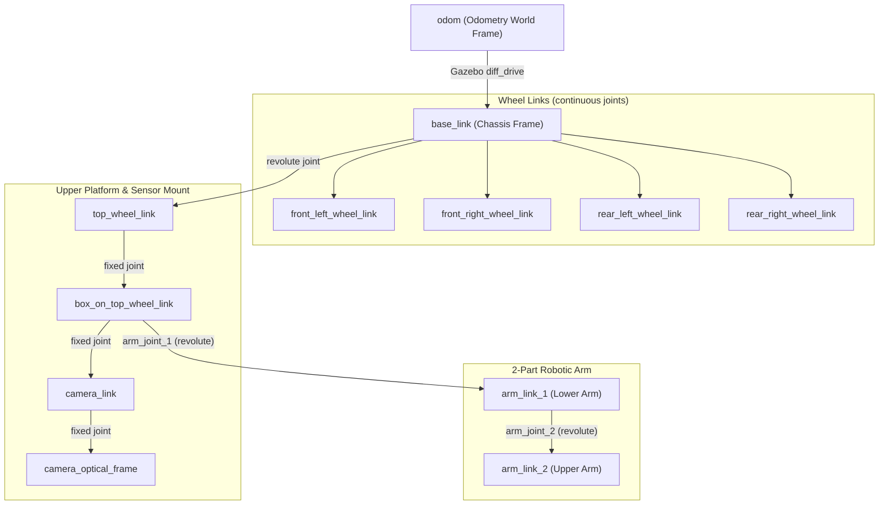
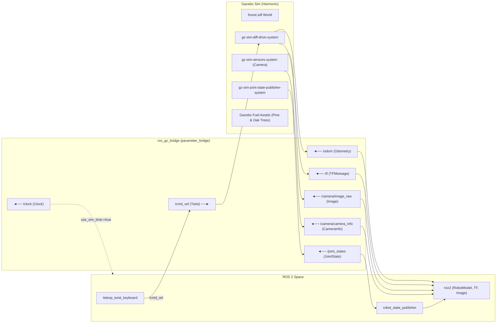

# URDF & Gazebo Simulation (`5.urdf`)

A practice and hands-on package for robot kinematic modeling with **URDF / Xacro** and physical dynamics simulation with **Gazebo Sim** (Harmonic / `ros_gz`), featuring RViz2 visualization, differential drive physics, Gazebo Fuel cloud world environments, and keyboard teleoperation.

---

## 📑 Table of Contents

- [URDF \& Gazebo Simulation (`5.urdf`)](#urdf--gazebo-simulation-5urdf)
  - [📑 Table of Contents](#-table-of-contents)
  - [📁 Package Architecture \& Directory Layout](#-package-architecture--directory-layout)
  - [🤖 Robot Modeling with URDF \& Xacro](#-robot-modeling-with-urdf--xacro)
    - [Core Components (`<link>`, `<visual>`, `<collision>`, `<inertial>`)](#core-components-link-visual-collision-inertial)
    - [Inertia Formulas for Common Geometries](#inertia-formulas-for-common-geometries)
    - [Joint Types \& Origin Conventions](#joint-types--origin-conventions)
      - [Setting Origins (Best Practice)](#setting-origins-best-practice)
    - [Xacro Modularity](#xacro-modularity)
  - [🎯 Coordinate Frames \& RViz Visualization](#-coordinate-frames--rviz-visualization)
    - [REP-103 Coordinate Conventions](#rep-103-coordinate-conventions)
    - [TF Tree \& Joint State Publishing](#tf-tree--joint-state-publishing)
  - [🌍 Gazebo Simulation \& ROS-Gz Integration](#-gazebo-simulation--ros-gz-integration)
    - [System Architecture](#system-architecture)
    - [Key Gazebo Sim Plugins](#key-gazebo-sim-plugins)
    - [ROS-Gz Bridge (`ros_gz_bridge`)](#ros-gz-bridge-ros_gz_bridge)
    - [Gazebo Fuel Cloud Assets](#gazebo-fuel-cloud-assets)
  - [🧭 Understanding Odometry (`odom`)](#-understanding-odometry-odom)
    - [Message Structure (`nav_msgs/msg/Odometry`)](#message-structure-nav_msgsmsgodometry)
    - [Coordinate Frame Conventions (REP-105)](#coordinate-frame-conventions-rep-105)
    - [Drift \& Localization](#drift--localization)
  - [🚀 Quickstart \& Execution Guide](#-quickstart--execution-guide)
    - [1. Environment \& Build Setup](#1-environment--build-setup)
    - [2. Inspect Model in RViz](#2-inspect-model-in-rviz)
    - [3. Run Gazebo Simulation](#3-run-gazebo-simulation)
    - [4. Keyboard Teleoperation](#4-keyboard-teleoperation)
      - [Keypad Layout \& Movement Controls](#keypad-layout--movement-controls)
      - [Speed Adjustment Controls](#speed-adjustment-controls)
  - [⚡ CLI Command Reference](#-cli-command-reference)
    - [URDF \& Xacro Tools](#urdf--xacro-tools)
    - [TF \& Transform Diagnostics](#tf--transform-diagnostics)
    - [Gazebo Sim Direct CLI](#gazebo-sim-direct-cli)
  - [💡 Tips \& Troubleshooting](#-tips--troubleshooting)
    - [1. VS Code XML Syntax Highlighting for URDF / Xacro](#1-vs-code-xml-syntax-highlighting-for-urdf--xacro)
    - [2. Gazebo Joint Dynamics \& implicitSpringDamper](#2-gazebo-joint-dynamics--implicitspringdamper)

---

## 📁 Package Architecture & Directory Layout

The workspace contains the `simple_car_description` package, which defines a 4-wheeled mobile robot with an upper rotating sensor mount, modular Xacro macros, Gazebo physics plugins, and custom SDF simulation worlds.

```text
5.urdf/
├── simple_car.urdf                 # Standalone/compiled reference URDF
└── src/
    └── simple_car_description/
        ├── CMakeLists.txt          # ament_cmake build configuration
        ├── package.xml             # Package dependencies and metadata
        ├── config/
        │   └── gazebo_bridge.yaml  # ROS 2 <-> Gazebo topic mapping rules
        ├── launch/
        │   ├── display.launch.py   # RViz visualization launcher (Python)
        │   ├── display.launch.xml  # RViz visualization launcher (XML)
        │   ├── gazebo.launch.py    # Gazebo simulation launcher (Python)
        │   └── gazebo.launch.xml   # Gazebo simulation launcher (XML)
        ├── meshes/
        │   └── visual/
        │       └── waffle_base.stl # Chassis 3D visual mesh (TurtleBot3 Waffle base)
        ├── rviz/
        │   └── display.rviz        # Pre-configured RViz display profile
        ├── urdf/
        │   ├── simple_car.urdf.xacro      # Top-level robot description entry point
        │   ├── simple_car.properties.xacro# Dimensional & mass parameters
        │   ├── simple_car.materials.xacro # Color and material definitions
        │   ├── simple_car.inertias.xacro  # Standard inertia calculation macros
        │   ├── simple_car.wheel.xacro     # Reusable wheel macro (link + joint)
        │   ├── simple_car.arm.xacro       # 2-part robotic arm macro (links, joints, Gazebo)
        │   ├── simple_car.gazebo.xacro    # Gazebo system plugins (Diff Drive, Joint States)
        │   └── simple_car.urdf            # Pre-generated raw URDF
        └── worlds/
            └── forest.sdf          # Forest simulation world with Gazebo Fuel assets
```

---

## 🤖 Robot Modeling with URDF & Xacro

**URDF (Unified Robot Description Format)** is an XML specification used in ROS to represent a robot's kinematics, visual appearance, collision boundaries, and mass distributions.

### Core Components (`<link>`, `<visual>`, `<collision>`, `<inertial>`)

A robot model is composed of a tree of rigid **links** connected by **joints**.

```xml
<link name="chassis_link">
    <!-- 1. Visual: Graphical rendering in RViz and Gazebo -->
    <visual>
        <geometry>
            <mesh filename="package://simple_car_description/meshes/visual/waffle_base.stl" scale="1 1 1"/>
        </geometry>
        <origin xyz="0 0 0" rpy="0 0 0"/>
        <material name="blue"/>
    </visual>

    <!-- 2. Collision: Simplified geometry used by physics engines -->
    <collision>
        <geometry>
            <box size="0.6 0.4 0.2"/>
        </geometry>
        <origin xyz="0 0 0.1" rpy="0 0 0"/>
    </collision>

    <!-- 3. Inertial: Mass and inertia tensor (Required for Gazebo physics) -->
    <inertial>
        <mass value="5.0"/>
        <origin xyz="0 0 0.1" rpy="0 0 0"/>
        <inertia ixx="0.0833" ixy="0" ixz="0" iyy="0.1667" iyz="0" izz="0.2167"/>
    </inertial>
</link>
```

- **`<visual>`**: Defines the 3D graphical appearance (primitives or meshes). Meshes can be referenced using `package://<package_name>/...`.
- **`<collision>`**: Defines the simplified boundary geometry used for collision detection. Using simple primitives (box, cylinder, sphere) instead of detailed meshes significantly improves physics performance.
- **`<inertial>`**: Defines the physical mass and mass distribution. **Required for dynamic simulation in Gazebo**. Links missing inertial parameters are treated as static or ignored by the physics solver:
  - `<mass value="..."/>`: Mass in kilograms ($kg$).
  - `<origin xyz="..." rpy="..."/>`: Position and orientation of the **Center of Mass (COM)** relative to the link frame.
  - `<inertia ixx="..." ixy="..." ixz="..." iyy="..." iyz="..." izz="..."/>`: $3 \times 3$ symmetric moment of inertia matrix ($kg \cdot m^2$), measuring resistance to rotational acceleration about the principal axes.

---

### Inertia Formulas for Common Geometries

| Geometry           | Diagram / Dimensions                              | Moment of Inertia Formulas                                                                                                      |
| :----------------- | :------------------------------------------------ | :------------------------------------------------------------------------------------------------------------------------------ |
| **Solid Box**      | Width $x$, Depth $y$, Height $z$, Mass $m$        | $$I_{xx} = \frac{1}{12} m (y^2 + z^2)$$<br/>$$I_{yy} = \frac{1}{12} m (x^2 + z^2)$$<br/>$$I_{zz} = \frac{1}{12} m (x^2 + y^2)$$ |
| **Solid Cylinder** | Radius $r$, Height $h$ (along $z$-axis), Mass $m$ | $$I_{xx} = I_{yy} = \frac{1}{12} m (3r^2 + h^2)$$<br/>$$I_{zz} = \frac{1}{2} m r^2$$                                            |
| **Solid Sphere**   | Radius $r$, Mass $m$                              | $$I_{xx} = I_{yy} = I_{zz} = \frac{2}{5} m r^2$$                                                                                |

> [!NOTE]
> **Inertia Visualization in Gazebo & RViz**: The inertia tensor is rendered as an *equivalent uniform inertia box*. For radially symmetric cylinders ($I_{xx} = I_{yy}$), this equivalent box appears as a square cross-section ($\sqrt{3}r \times \sqrt{3}r$) along the circular face.

For additional geometries, refer to the [Wikipedia List of Moments of Inertia](https://en.wikipedia.org/wiki/List_of_moments_of_inertia#List_of_3D_inertia_tensors).

---

### Joint Types & Origin Conventions

Joints define the kinematic and dynamic relationships (constraints and degrees of freedom) between a **parent link** and a **child link**.

| Joint Type       | Degrees of Freedom (DoF) | Motion Description                                      | Typical Usage                                        |
| :--------------- | :----------------------: | :------------------------------------------------------ | :--------------------------------------------------- |
| **`revolute`**   |            1             | Rotates about a single axis with bounded limits         | Elbow, knee, steering knuckle                        |
| **`continuous`** |            1             | Rotates continuously about an axis with no angle limits | Wheels, propellers, continuous turrets               |
| **`prismatic`**  |            1             | Slides linearly along a single axis                     | Linear actuators, elevators, pistons                 |
| **`fixed`**      |            0             | Rigidly attached, zero degrees of freedom               | Sensor mounts, static brackets, camera bases         |
| **`floating`**   |            6             | Translates and rotates freely in 3D space               | Free-floating camera, underwater vehicles            |
| **`planar`**     |            3             | Moves translationally and rotates within a 2D plane     | Air hockey puck, omnidirectional base on flat ground |

#### Setting Origins (Best Practice)
When building URDF kinematic chains:
1. **Set the Joint Origin first**: Specify `<origin xyz="..." rpy="..."/>` in the `<joint>` tag to position the joint axis relative to the parent link frame.
2. **Set the Child Link Geometry/Inertial Origins second**: Position the child link's `<visual>`, `<collision>`, and `<inertial>` relative to the newly created joint coordinate frame.

---

### Xacro Modularity

**Xacro (XML Macros)** allows writing modular, maintainable, and parameterized robot models using:
- **Constants / Properties**: `<xacro:property name="wheel_radius" value="0.05"/>`
- **Math Expressions**: `${base_width / 2 + wheel_width / 2}`
- **Reusable Macros**: Defining a `<xacro:macro name="wheel" params="name x y">` and instantiating it for all four wheels.
- **Includes**: Splitting definitions across `*.materials.xacro`, `*.inertias.xacro`, `*.gazebo.xacro`, and `*.properties.xacro`.

---

## 🎯 Coordinate Frames & RViz Visualization

### REP-103 Coordinate Conventions

ROS follows [REP-103: Standard Units of Measure & Coordinate Conventions](https://www.ros.org/reps/rep-0103.html). All coordinate frames adhere to the **Right-Hand Rule**:

```text
       +Z (Blue) [Up]
        ^
        |
        |
        +----> +Y (Green) [Left]
       /
      /
     v
   +X (Red) [Forward]
```

- **X-axis (Red)**: Points **Forward**
- **Y-axis (Green)**: Points **Left**
- **Z-axis (Blue)**: Points **Up**

---

### TF Tree & Joint State Publishing



- **`robot_state_publisher`**: Reads the URDF from `robot_description` and listens to `/joint_states`, computing the forward kinematics and broadcasting the TF transform tree (`/tf` and `/tf_static`).
- **`joint_state_publisher_gui`**: Provides an interactive GUI slider interface to manipulate joint angles and verify link transforms in RViz before running physics simulations.

---

## 🌍 Gazebo Simulation & ROS-Gz Integration

**Gazebo Sim** (formerly Ignition Gazebo / `ros_gz`) is a physics simulation platform simulating rigid body dynamics, surface friction, collisions, and sensor data.

### System Architecture



---

### Key Gazebo Sim Plugins

The robot description and world configure the following system plugins:

1. **`gz-sim-sensors-system`** (World & Robot):
   - Powers rendering-based sensors (cameras, LiDAR) using the OGRE 2 render engine.
   - Publishes raw camera images and camera calibration parameters to Gazebo topics (`/camera/image_raw`, `/camera/camera_info`).
2. **`gz-sim-joint-state-publisher-system`**:
   - Monitors positions and velocities of all moving joints (`wheel_joint`, wheel joints).
   - Publishes joint telemetry to the Gazebo `/joint_states` topic.
3. **`gz-sim-diff-drive-system`**:
   - Subscribes to `/cmd_vel` to drive the left and right wheels based on differential steering kinematics.
   - Calculates odometry from wheel encoder displacement and publishes `/odom` and TF transforms (`odom -> base_link`).

---

### ROS-Gz Bridge (`ros_gz_bridge`)

`ros_gz_bridge` provides bi-directional data conversion between Gazebo Sim topics and ROS 2 topics, configured via [`config/gazebo_bridge.yaml`](file:///Users/kin/Documents/shared/ros-practice/5.urdf/src/simple_car_description/config/gazebo_bridge.yaml):

| ROS 2 Topic           | ROS 2 Type                   | Gazebo Topic          | Gazebo Type          |  Direction  | Purpose                                                          |
| :-------------------- | :--------------------------- | :-------------------- | :------------------- | :---------: | :--------------------------------------------------------------- |
| `/clock`              | `rosgraph_msgs/msg/Clock`    | `/clock`              | `gz.msgs.Clock`      | `GZ_TO_ROS` | Synchronizes ROS nodes to simulation time (`use_sim_time:=true`) |
| `/joint_states`       | `sensor_msgs/msg/JointState` | `/joint_states`       | `gz.msgs.Model`      | `GZ_TO_ROS` | Feeds joint positions to `robot_state_publisher` & RViz          |
| `/cmd_vel`            | `geometry_msgs/msg/Twist`    | `/cmd_vel`            | `gz.msgs.Twist`      | `ROS_TO_GZ` | Sends velocity commands to the differential drive plugin         |
| `/odom`               | `nav_msgs/msg/Odometry`      | `/odom`               | `gz.msgs.Odometry`   | `GZ_TO_ROS` | Relays wheel odometry estimate to ROS 2                          |
| `/tf`                 | `tf2_msgs/msg/TFMessage`     | `/tf`                 | `gz.msgs.Pose_V`     | `GZ_TO_ROS` | Broadcasts `odom -> base_link` dynamic transform                 |
| `/camera/image_raw`   | `sensor_msgs/msg/Image`      | `/camera/image_raw`   | `gz.msgs.Image`      | `GZ_TO_ROS` | Relays camera RGB image stream to ROS 2                          |
| `/camera/camera_info` | `sensor_msgs/msg/CameraInfo` | `/camera/camera_info` | `gz.msgs.CameraInfo` | `GZ_TO_ROS` | Relays camera intrinsic parameters to ROS 2                      |

---

### Gazebo Fuel Cloud Assets

Gazebo Sim natively streams and caches 3D simulation assets from [Gazebo Fuel](https://app.gazebosim.org).
- World files (`worlds/forest.sdf`) directly reference online models via Fuel URIs:
  - `https://fuel.gazebosim.org/1.0/OpenRobotics/models/Pine Tree`
  - `https://fuel.gazebosim.org/1.0/OpenRobotics/models/Oak tree`
- On initial launch, models are automatically downloaded and cached locally to `~/.gz/fuel/fuel.gazebosim.org/`.
- Subsequent launches use the cached models offline without network overhead.

---

## 🧭 Understanding Odometry (`odom`)

**Odometry** estimates a robot's pose (position and orientation) over time by integrating motion data from wheel encoders.

### Message Structure (`nav_msgs/msg/Odometry`)

```text
nav_msgs/msg/Odometry
├── std_msgs/Header header
│   ├── time stamp
│   └── string frame_id         # Fixed reference frame (e.g. "odom")
├── string child_frame_id       # Robot moving frame (e.g. "base_link")
├── geometry_msgs/PoseWithCovariance pose
│   ├── Pose pose               # Position (x, y, z) & Orientation Quaternion (x, y, z, w)
│   └── float64[36] covariance  # 6x6 Pose uncertainty matrix
└── geometry_msgs/TwistWithCovariance twist
    ├── Twist twist             # Linear velocities (vx, vy, vz) & Angular velocities (wx, wy, wz)
    └── float64[36] covariance  # 6x6 Velocity uncertainty matrix
```

---

### Coordinate Frame Conventions (REP-105)

[REP-105: Coordinate Frames for Mobile Platforms](https://www.ros.org/reps/rep-0105.html) defines the standard frame hierarchy for mobile robotics:

```text
map (Global fixed frame, drift-free, discontinuous during loop closures)
 └── odom (World-fixed frame, smooth & continuous, accumulates dead-reckoning drift)
      └── base_link (Robot chassis origin rigidly attached to the mobile platform)
           ├── front_left_wheel_link
           ├── front_right_wheel_link
           └── sensor_link (LiDAR, Camera, IMU)
```

---

### Drift & Localization

- **Dead Reckoning Drift**: Odometry is smooth and high-frequency, but accumulates cumulative errors over time due to wheel slip, wheel radius variance, uneven terrain, and numerical integration errors.
- **Global Localization**: In autonomous navigation (Nav2 / SLAM), global localization nodes (e.g., AMCL, Cartographer) correct long-term odometric drift by estimating the `map -> odom` transform against global landmarks or map features.

---

## 🚀 Quickstart & Execution Guide

### 1. Environment & Build Setup

```bash
# Navigate to the 5.urdf workspace
cd 5.urdf

# Allow direnv to auto-source the workspace (or manually run: source install/setup.bash)
direnv allow

# Build the package with symlink-install
colcon build --packages-select simple_car_description --symlink-install
source install/setup.bash
```

> [!TIP]
> Using `--symlink-install` links Xacro/URDF/mesh files directly to the build install directory. Any edits made to `.xacro` files take effect immediately on the next launch without requiring a rebuild!

---

### 2. Inspect Model in RViz

Verify the URDF kinematic tree, geometry, and joint limits interactively using `joint_state_publisher_gui`:

```bash
# Launch with Python launch file
ros2 launch simple_car_description display.launch.py

# Or launch with XML launch file
ros2 launch simple_car_description display.launch.xml
```

---

### 3. Run Gazebo Simulation

Launch full physical simulation in Gazebo Sim with the default Forest World:

```bash
# Launch robot in Forest World (Default)
ros2 launch simple_car_description gazebo.launch.py

# Launch with RViz visualization enabled alongside Gazebo
ros2 launch simple_car_description gazebo.launch.py rviz:=true

# Launch with an empty world instead of the forest
ros2 launch simple_car_description gazebo.launch.py world:=empty.sdf

# Spawn robot at custom coordinates (e.g. x=1.5, y=2.0, z=0.2)
ros2 launch simple_car_description gazebo.launch.py x:=1.5 y:=2.0 z:=0.2

# Equivalent XML launch execution
ros2 launch simple_car_description gazebo.launch.xml rviz:=true
```

---

### 4. Keyboard Teleoperation

In a separate terminal, run the teleop node to drive the car:

```bash
ros2 run teleop_twist_keyboard teleop_twist_keyboard
```

#### Keypad Layout & Movement Controls

```text
    u   i   o       (↖  ↑  ↗)
    j   k   l       (← stop →)
    m   ,   .       (↙  ↓  ↘)
```

|        Key        | Action               | Description                                  |
| :---------------: | :------------------- | :------------------------------------------- |
|      **`i`**      | **Forward**          | Drive straight forward                       |
| **`,`** *(comma)* | **Backward**         | Drive straight backward                      |
|      **`j`**      | **Turn Left**        | Rotate in place counter-clockwise            |
|      **`l`**      | **Turn Right**       | Rotate in place clockwise                    |
|      **`u`**      | **Forward + Left**   | Curve forward to the left                    |
|      **`o`**      | **Forward + Right**  | Curve forward to the right                   |
|      **`m`**      | **Backward + Left**  | Curve backward to the left                   |
|  **`.`** *(dot)*  | **Backward + Right** | Curve backward to the right                  |
| **`k`** / *other* | **Stop**             | Stop all movement (sets velocities to `0.0`) |

#### Speed Adjustment Controls

|        Key        | Action                      | Effect                                       |
| :---------------: | :-------------------------- | :------------------------------------------- |
| **`q`** / **`z`** | **Linear & Angular Speeds** | Increase / Decrease all speeds by **10%**    |
| **`w`** / **`x`** | **Linear Speed Only**       | Increase / Decrease linear speed by **10%**  |
| **`e`** / **`c`** | **Angular Speed Only**      | Increase / Decrease angular speed by **10%** |

---

## ⚡ CLI Command Reference

### URDF & Xacro Tools

```bash
# Process and compile Xacro into raw URDF
xacro src/simple_car_description/urdf/simple_car.urdf.xacro -o /tmp/robot.urdf

# Validate URDF syntax and link/joint tree structure
check_urdf /tmp/robot.urdf

# Print robot_description parameter from active robot_state_publisher
ros2 param get /robot_state_publisher robot_description

# Echo live joint state positions and velocities
ros2 topic echo /joint_states
```

### TF & Transform Diagnostics

```bash
# Generate a visual PDF of the complete TF transform tree
ros2 run tf2_tools view_frames

# Check dynamic transform between two specific frames
ros2 run tf2_ros tf2_echo odom base_link

# Monitor TF topic publishing frequency and status
ros2 topic hz /tf
```

### Gazebo Sim Direct CLI

```bash
# Open standalone Gazebo Sim GUI
gz sim

# Directly launch a world file unpaused (-r flag)
gz sim src/simple_car_description/worlds/forest.sdf -r

# List active Gazebo native topic
gz topic -l

# Echo Gazebo native odometry topic
gz topic -e -t /odom
```

---

## 💡 Tips & Troubleshooting

### 1. VS Code XML Syntax Highlighting for URDF / Xacro
To enable rich syntax highlighting and XML validation for `.urdf` and `.xacro` files in VS Code:
1. Open **Settings** (`Cmd+,` on macOS / `Ctrl+,` on Linux/Windows).
2. Search for **File Associations**.
3. Add item: `*.urdf` $\rightarrow$ Value: `xml`
4. Add item: `*.xacro` $\rightarrow$ Value: `xml`

---

### 2. Gazebo Joint Dynamics & `implicitSpringDamper`

When configuring joint damping or friction in URDF (`<dynamics damping="..." friction="..."/>`), physics engines (such as ODE) use explicit Euler integration by default. With discrete simulation time steps (e.g. $1\text{ ms}$), high damping or stiffness can cause high-frequency joint jitter or numerical instability.

**Fix**: Enable implicit integration per joint in Gazebo to solve damping within the constraint matrix:

```xml
<gazebo reference="arm_joint_1">
    <implicitSpringDamper>true</implicitSpringDamper>
</gazebo>
```

> [!TIP]
> **Best Practice**: Always set `<implicitSpringDamper>true</implicitSpringDamper>` on robotic arms, suspension joints, and high-damping revolute joints to ensure smooth, jitter-free, and numerically stable physics in Gazebo.

