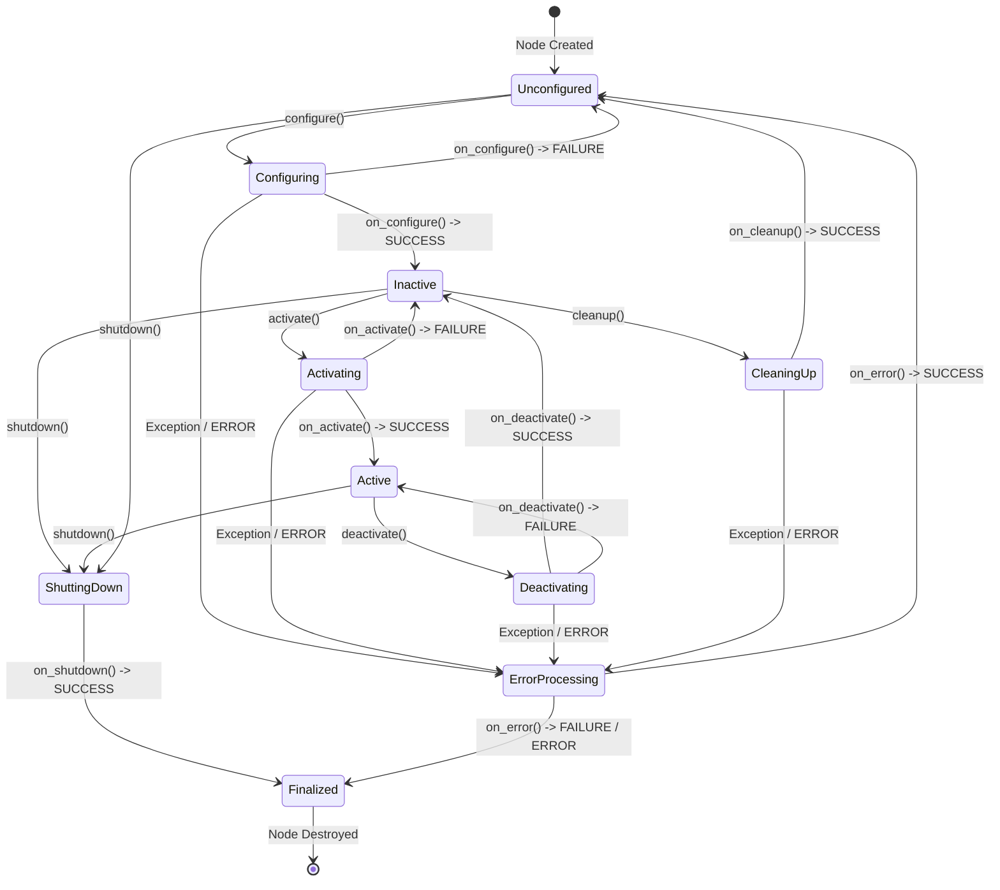
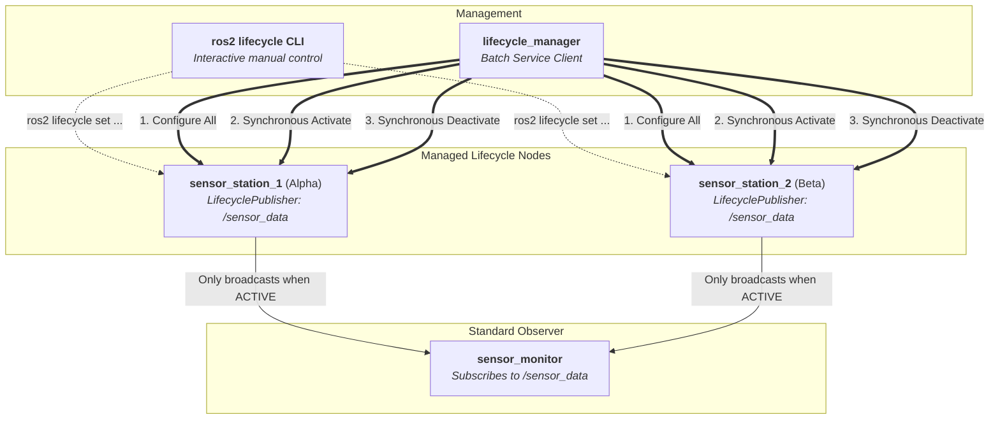

# 7. Lifecycle Nodes & Lifecycle Publishers

ROS 2 **Lifecycle Nodes** (also known as **Managed Nodes**) provide a deterministic, state-machine-driven lifecycle for robotics nodes. 

Instead of spinning up publishers, subscriptions, and hardware loops inside constructors, a managed node explicitly navigates through well-defined lifecycle states. This guarantees predictable startup sequences, prevents uncalibrated or partial data propagation, and enables **synchronized multi-node activation and deactivation**.

---

## 🌟 Core Concepts

### 1. The Lifecycle State Machine

A Lifecycle Node transitions between **4 Primary States** via **Transition States**:



| Primary State | State ID | Description |
| :--- | :---: | :--- |
| **Unconfigured** | `1` | Node is instantiated. No dynamic resources, timers, or hardware connections are open. |
| **Inactive** | `2` | Static resources, parameters, publishers, and timers are configured. However, **message publishing is disabled**. |
| **Active** | `3` | Node is fully operational. **LifecyclePublishers transmit messages** onto DDS / ROS 2 network. |
| **Finalized** | `4` | Terminal state before node destruction. Resources are released. |

---

### 2. Lifecycle Publishers

A `LifecyclePublisher` (`rclcpp_lifecycle::LifecyclePublisher` in C++, `LifecyclePublisher` in Python) is lifecycle-aware:
- In `Unconfigured` or `Inactive` states: Calling `publish()` is a **safe no-op** (messages are dropped and not sent to the network).
- In `on_activate()`: Calling `pub->on_activate()` transitions the publisher to active, allowing data to flow.
- In `on_deactivate()`: Calling `pub->on_deactivate()` immediately mutes topic broadcasts without destroying the node or thread.

---

### 3. Coordinated Multi-Node Activation

One of the greatest architectural benefits of Lifecycle Nodes is **subsystem synchronization**:
- In multi-sensor setups (e.g. cameras, LiDARs, IMUs), bringing them all into `INACTIVE` state verifies configuration without publishing unsynchronized streams.
- Once all sensors confirm `INACTIVE`, a central coordinator transitions them all to `ACTIVE` at the exact same instant, ensuring synchronized data streams from time step zero.

---

## 🏗️ Practice Architecture

This practice module sets up two independent sensor stations streaming to a common topic `/sensor_data`, observed by a monitor node and orchestrated either manually or via a manager:



---

## 🚀 Quickstart & Commands

### 1. Setup & Build

```bash
# Enable direnv to auto-source install/setup.bash
direnv allow

# Build both C++ and Python packages
colcon build

# Or build selectively
colcon build --packages-select lifecycle_cpp_pkg
colcon build --packages-select lifecycle_py_pkg
```

---

### 2. Practice Scenario A: Manual CLI Orchestration (Interactive)

Launch the system with `auto_manage:=false` (default) so that both sensor stations stay in `UNCONFIGURED` state:

```bash
# In Terminal 1 (C++ implementation)
ros2 launch lifecycle_cpp_pkg lifecycle.launch.py
# (or Python implementation)
# ros2 launch lifecycle_py_pkg lifecycle.launch.py
```

Now open a second terminal to inspect and transition the nodes step-by-step:

#### Inspect Initial States
```bash
# Check current lifecycle state
ros2 lifecycle get /sensor_station_1
# Output: unconfigured [1]

ros2 lifecycle get /sensor_station_2
# Output: unconfigured [1]

# List available transitions from the current state
ros2 lifecycle list /sensor_station_1
# Available transitions:
# - configure [1]
# - shutdown [5]
```

#### Step 1: Configure both nodes
```bash
ros2 lifecycle set /sensor_station_1 configure
ros2 lifecycle set /sensor_station_2 configure
```
> **Observe Terminal 1:** Both stations report state `INACTIVE`. Timers are firing, but `[INACTIVE]` log notices show message transmission is suppressed. Notice that `sensor_monitor` receives **zero** messages.

#### Step 2: Synchronously Activate both stations
```bash
# Activate both nodes together
ros2 lifecycle set /sensor_station_1 activate && ros2 lifecycle set /sensor_station_2 activate
```
> **Observe Terminal 1:** Both stations report state `ACTIVE`. Both lifecycle publishers simultaneously begin streaming live data onto `/sensor_data`, and `sensor_monitor` immediately logs incoming messages from both stations!

#### Step 3: Synchronously Deactivate
```bash
# Deactivate both nodes together
ros2 lifecycle set /sensor_station_1 deactivate && ros2 lifecycle set /sensor_station_2 deactivate
```
> **Observe Terminal 1:** Both stations return to `INACTIVE`. Message flow halts immediately, while the processes remain alive.

#### Step 4: Cleanup & Shutdown
```bash
# Cleanup allocated resources (returns to UNCONFIGURED)
ros2 lifecycle set /sensor_station_1 cleanup && ros2 lifecycle set /sensor_station_2 cleanup

# Shutdown to FINALIZED
ros2 lifecycle set /sensor_station_1 shutdown && ros2 lifecycle set /sensor_station_2 shutdown
```

---

### 3. Practice Scenario B: Automated Programmatic Orchestration

Run the launch file with `auto_manage:=true` to observe the `lifecycle_manager` node automatically coordinate the state machine:

```bash
# Run C++ coordinated lifecycle demonstration
ros2 launch lifecycle_cpp_pkg lifecycle.launch.py auto_manage:=true

# Or run using XML launch format
ros2 launch lifecycle_cpp_pkg lifecycle.launch.xml auto_manage:=true

# Or Python package
ros2 launch lifecycle_py_pkg lifecycle.launch.py auto_manage:=true
```

**The manager automatically executes:**
1. Queries `get_state` on both `/sensor_station_1` and `/sensor_station_2`.
2. Calls `/change_state` (`configure`) on all nodes $\rightarrow$ all become `INACTIVE` (4s silence verification).
3. Calls `/change_state` (`activate`) **simultaneously** on all nodes $\rightarrow$ all become `ACTIVE` (8s live data stream).
4. Calls `/change_state` (`deactivate`) **simultaneously** on all nodes $\rightarrow$ message flow halts.
5. Calls `/change_state` (`cleanup` then `shutdown`).

---

### 4. Running Nodes Manually (Without Launch)

```bash
# Terminal 1: Run sensor monitor
ros2 run lifecycle_cpp_pkg sensor_monitor

# Terminal 2: Run sensor station 1
ros2 run lifecycle_cpp_pkg sensor_station --ros-args -r __node:=sensor_station_1 -p sensor_name:=alpha

# Terminal 3: Run sensor station 2
ros2 run lifecycle_cpp_pkg sensor_station --ros-args -r __node:=sensor_station_2 -p sensor_name:=beta

# Terminal 4: Transition using CLI or run manager
ros2 run lifecycle_cpp_pkg lifecycle_manager
```

---

## ⚡ Lifecycle CLI & Service Command Reference

### Lifecycle CLI
```bash
# Get node state
ros2 lifecycle get /sensor_station_1

# List available transitions from current state
ros2 lifecycle list /sensor_station_1

# Trigger transitions
ros2 lifecycle set /sensor_station_1 configure
ros2 lifecycle set /sensor_station_1 activate
ros2 lifecycle set /sensor_station_1 deactivate
ros2 lifecycle set /sensor_station_1 cleanup
ros2 lifecycle set /sensor_station_1 shutdown
```

### Direct Service Invocations
Under the hood, lifecycle nodes expose standard services in the `lifecycle_msgs` namespace:

```bash
# List lifecycle services
ros2 service list | grep sensor_station

# Query state via service
ros2 service call /sensor_station_1/get_state lifecycle_msgs/srv/GetState "{}"

# Trigger transition via service (Transition IDs: 1=configure, 2=cleanup, 3=activate, 4=deactivate, 5=shutdown)
ros2 service call /sensor_station_1/change_state lifecycle_msgs/srv/ChangeState "{transition: {id: 3, label: 'activate'}}"
```

### Topic Verification
```bash
# Check topic publishing rate while active vs inactive
ros2 topic hz /sensor_data

# Echo live messages
ros2 topic echo /sensor_data
```

---

## 💡 Best Practices & Key Takeaways

1. **Never allocate heavy resources or start hardware loops in the constructor**: Constructors in Lifecycle nodes should only declare parameters and set initial defaults. Reserve hardware socket connections, large memory allocations, and publishers for `on_configure()`.
2. **Always check `pub->is_activated()`**: Although `LifecyclePublisher::publish()` automatically drops messages when inactive, checking `is_activated()` prevents wasted serialization and computation of message payloads during inactive states.
3. **Handle Return Codes**: Every lifecycle callback (`on_configure`, `on_activate`, etc.) must return one of three values:
   - `SUCCESS`: Transition completes to the next primary state.
   - `FAILURE`: Transition fails and node safely returns to the previous primary state (or `Unconfigured`).
   - `ERROR`: Unexpected exception occurred; node transitions to `ErrorProcessing`.
4. **Coordinated Startup**: When designing multi-node robots, use a Lifecycle Manager node to verify all critical nodes reach `INACTIVE` (all hardware initialized and ready) before issuing simultaneous `ACTIVATE` transitions.
