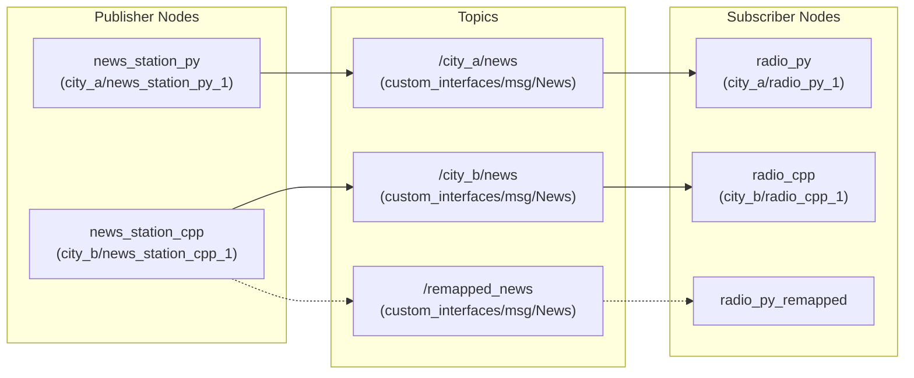
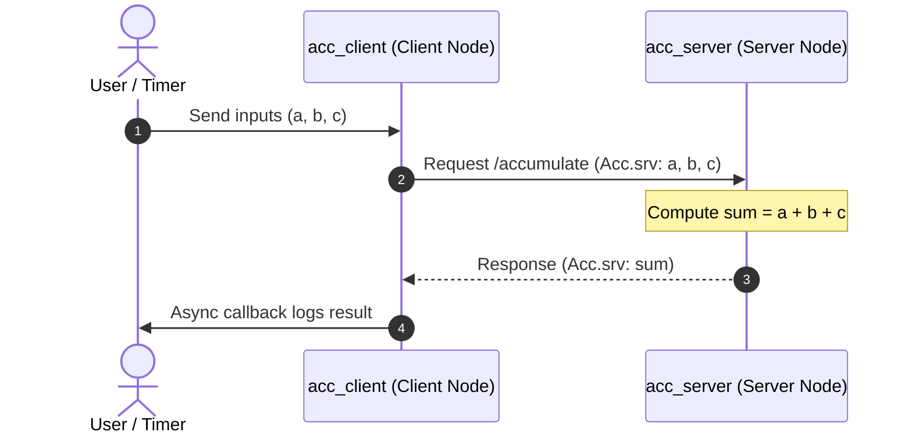
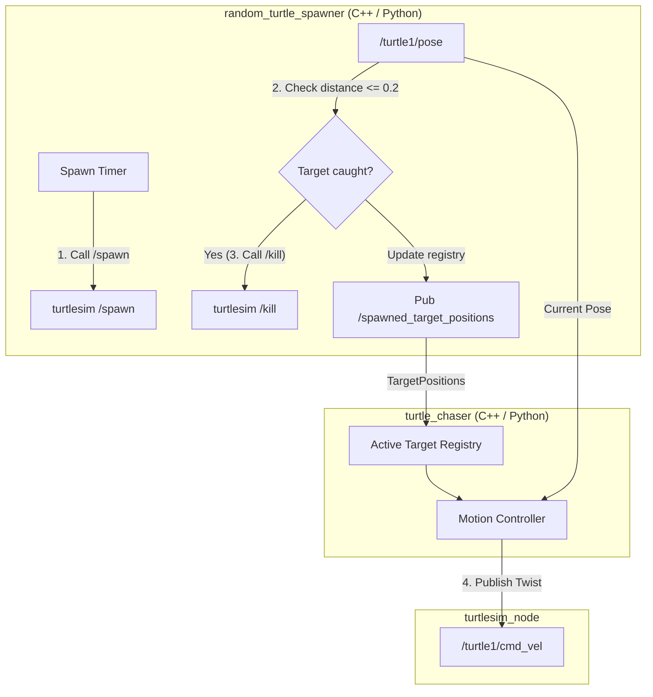

# ROS 2 Practices

A hands-on, modular ROS 2 practice repository demonstrating core robotics communication patterns, custom interface definitions, parameter management, launch orchestration, and an end-to-end multi-node Turtlesim project.

Every practice module provides parallel implementations in both **C++ (`rclcpp` / `ament_cmake`)** and **Python (`rclpy` / `ament_python`)**.

---

## 🛠️ Environments & Prerequisites

- **Operating System:** Ubuntu 24.04 LTS (Noble Numbat)
- **ROS 2 Distribution:** [ROS 2 Jazzy Jalisco](https://docs.ros.org/en/jazzy/)
- **Build System:** `colcon` with `ament_cmake` and `ament_python`
- **Languages:** C++17/C++20, Python 3.12
- **Environment Management:** `direnv` (auto-sources `install/setup.bash` on `cd`)
- **IDE Setup:** Pre-configured VS Code multi-root workspace ([`ros-practice.code-workspace`](./ros-practice.code-workspace))

---

## 📁 Repository Structure

```text
ros-practice/
├── 0.template/             # Boilerplate template for creating ROS 2 packages
│   └── src/
│       ├── service_cpp_pkg # C++ package template (ament_cmake)
│       └── service_py_pkg  # Python package template (ament_python)
├── 1.nodes/                # Fundamentals of ROS 2 Nodes & Execution
│   └── src/
│       ├── node_cpp_pkg    # OOP C++ node, timers, RCLCPP logging
│       └── node_py_pkg     # OOP Python node, timers, rclpy logging
├── 2.topics/               # Publish / Subscribe Architecture & Parameters
│   ├── config/             # YAML parameter configuration files
│   ├── topics_bringup/     # Python & XML launch files with namespaces & remappings
│   └── src/
│       ├── custom_interfaces # Custom News.msg message definition
│       ├── topic_cpp_pkg   # C++ publisher (news_station) & subscriber (radio)
│       └── topic_py_pkg    # Python publisher (news_station) & subscriber (radio)
├── 3.services/             # Client / Server Request-Response Pattern
│   └── src/
│       ├── custom_interfaces # Custom Acc.srv service definition
│       ├── service_cpp_pkg # C++ service server & asynchronous client
│       └── service_py_pkg  # Python service server & asynchronous client
├── 4.ex.chasing-turtle/    # End-to-End Turtlesim Chaser Integration Project
│   └── src/
│       ├── chasing_interfaces # Custom Target.msg & TargetPositions.msg
│       ├── chasing_cpp_pkg    # C++ spawner, chaser & XML launch
│       └── chasing_py_pkg     # Python spawner, chaser & XML launch
├── 5.urdf/                 # Robot URDF/Xacro modeling & Gazebo Sim simulation
│   └── src/
│       └── simple_car_description # Robot description, meshes, forest world, Gazebo plugins & launch
└── ros-practice.code-workspace # VS Code multi-root workspace configuration
```

---

## 📚 Modules Overview

### 0. Template (`0.template/`)
Boilerplate workspace for scaffolding new ROS 2 C++ and Python packages with standard directory layouts, `package.xml`, `CMakeLists.txt`, `setup.py`, and `.envrc`.

---

### 1. Nodes (`1.nodes/`)
Explores node lifecycle, object-oriented node encapsulation, timers, and logging.

- **Packages:**
  - `node_cpp_pkg`: `hello_world_node` (`rclcpp::Node` subclass, periodic timer callback, `RCLCPP_INFO` stream logging).
  - `node_py_pkg`: `hello_world_node` (`rclpy.node.Node` subclass, timer callback, `self.get_logger().info()`).
- **Core Concepts:**
  - Node initialization and lifecycle (`rclcpp::init`, `rclcpp::spin`, `rclpy.init`, `rclpy.spin`).
  - Node remapping at runtime (`--ros-args -r __node:=<new_name>`).
  - CLI node introspection (`ros2 node list`, `ros2 node info`, `rqt_graph`).

---

### 2. Topics & Parameters (`2.topics/`)
Demonstrates unidirectional, asynchronous, many-to-many publish-subscribe communication, custom message interfaces, dynamic parameter updates, and launch orchestration.



- **Packages:**
  - `custom_interfaces`: `News.msg` (`string datetime`, `string title`, `string content`).
  - `topic_cpp_pkg`:
    - `news_station`: Publishes news at configurable timer intervals with parameter change callbacks.
    - `radio`: Subscribes to `/news` and processes broadcast messages.
  - `topic_py_pkg`:
    - `news_station_node`: Python implementation supporting dynamic `timer_interval` parameters.
    - `radio_node`: Python subscriber node.
  - `topics_bringup`: Multi-node launch descriptions:
    - `topics.launch.py`: Launches Python and C++ stations/radios across namespaces (`city_a`, `city_b`), loads parameters from `config/news_station.yaml`, and configures topic remappings.
    - `topics.launch.xml`: Declarative XML equivalent for launch execution.
- **Key Features:**
  - Dynamic parameter declaration & runtime modification (`ros2 param set /news_station_node timer_interval 0.25`).
  - Loading parameters via YAML (`--params-file config/news_station.yaml`).
  - Topic metrics and debugging (`ros2 topic hz`, `ros2 topic bw`, `ros2 topic echo`).
  - Data recording and playback with `ros2 bag`.

---

### 3. Services (`3.services/`)
Demonstrates bidirectional, synchronous/asynchronous client-server request-response patterns using custom service specifications.



- **Packages:**
  - `custom_interfaces`: `Acc.srv` (Inputs: `int64 a, b, c` $\rightarrow$ Output: `int64 sum`).
  - `service_cpp_pkg`:
    - `acc_server`: Implements service callback adding three integers.
    - `acc_client`: Asynchronous service client utilizing `rclcpp::Client::async_send_request` with future callbacks and retry mechanisms.
  - `service_py_pkg`:
    - `acc_server`: Python service server with `create_service`.
    - `acc_client`: Python asynchronous client using `call_async` and future callbacks.
- **Key Features:**
  - Asynchronous non-blocking client calls preventing thread starvation.
  - Service inspection (`ros2 service list`, `ros2 service type`, `ros2 interface show`).
  - CLI service triggering (`ros2 service call /accumulate custom_interfaces/srv/Acc "{a: 1, b: 2, c: 3}"`).

---

### 4. Exercise: Chasing Turtle (`4.ex.chasing-turtle/`)
An end-to-end multi-agent robotics project combining services, topics, custom interfaces, geometry transforms, and a proportional closed-loop controller in Turtlesim.



- **Packages:**
  - `chasing_interfaces`:
    - `Target.msg` (`string name`, `geometry_msgs/Point position`).
    - `TargetPositions.msg` (`chasing_interfaces/Target[] targets`).
  - `chasing_cpp_pkg` & `chasing_py_pkg`:
    - `random_turtle_spawner`:
      - Periodically calls `/spawn` (`turtlesim/srv/Spawn`) with randomized coordinates $(x \in [1.0, 10.0], y \in [1.0, 10.0])$.
      - Tracks active target names and positions.
      - Monitors `/turtle1/pose` (`turtlesim/msg/Pose`), catches targets within $d \le 0.2$, calls `/kill` (`turtlesim/srv/Kill`), and broadcasts `/spawned_target_positions`.
      - Employs pending-request guards to avoid redundant concurrent spawn/kill service invocations.
    - `turtle_chaser`:
      - Selects the closest target using squared distance ordering:
        $$d_i^2 = (x_i - x)^2 + (y_i - y)^2 \implies i^* = \operatorname*{arg\,min}_i d_i^2$$
      - Locks onto the active target until it is killed.
      - Calculates target displacement and desired heading:
        $$\Delta x = x_t - x, \quad \Delta y = y_t - y, \quad \theta_d = \operatorname{atan2}(\Delta y, \Delta x)$$
      - Normalizes heading error to $[-\pi, \pi]$ using unit-circle projection:
        $$e_\theta = \operatorname{atan2}(\sin(\theta_d - \theta), \cos(\theta_d - \theta))$$
      - Controls velocities proportionally:
        $$\omega = k_\omega \cdot e_\theta \quad (k_\omega = 4.0)$$
        $$v = \begin{cases} \min(v_{\max}, k_v \cdot d), & |e_\theta| < 0.5\text{ rad} \\ 0, & |e_\theta| \ge 0.5\text{ rad} \end{cases} \quad (k_v = 1.5, v_{\max} = 2.0)$$
- **Launch Files:**
  - `random_turtle_spawner.launch.xml`: Launches `turtlesim_node`, `random_turtle_spawner`, and `turtle_chaser` with configurable `duration` parameter.

---

### 5. URDF & Gazebo Sim (`5.urdf/`)
Robot kinematics modeling with URDF/Xacro, Gazebo Sim Harmonic physics simulation, Gazebo Fuel cloud model integration, and keyboard teleoperation.

- **Packages:**
  - `simple_car_description`:
    - `urdf/`: Modular Xacro descriptions (`simple_car.urdf.xacro`, `wheel.xacro`, `inertias.xacro`, `gazebo.xacro`).
    - `worlds/`: `forest.sdf` featuring Pine & Oak trees from Gazebo Fuel (`app.gazebosim.org`), realistic lighting, and grass ground.
    - `config/`: `gazebo_bridge.yaml` bridging `/clock`, `/joint_states`, `/cmd_vel`, `/odom`, and `/tf`.
    - `launch/`: Python and XML launch files for RViz display (`display.launch.*`) and Gazebo Sim world execution (`gazebo.launch.*`).

---

## 🚀 Quickstart Guide

Each numbered folder is an independent ROS 2 workspace.

### 1. Workspace Activation with `direnv`
Each sub-workspace includes a `.envrc` file configured to automatically source `install/setup.bash`.

```bash
# Allow direnv inside the target directory (one-time setup)
cd 4.ex.chasing-turtle
direnv allow
```

*Alternatively, manually source the environment after building:*
```bash
source install/setup.bash
```

### 2. Building Packages with `colcon`

```bash
# Build all packages in the workspace
colcon build

# Or build specific packages
colcon build --packages-select node_cpp_pkg node_py_pkg
colcon build --packages-up-to chasing_cpp_pkg chasing_py_pkg
```

### 3. Running Examples

#### Running 1.nodes
```bash
cd 1.nodes
colcon build && source install/setup.bash
ros2 run node_cpp_pkg hello_world_node
# or
ros2 run node_py_pkg hello_world_node
```

#### Running 2.topics (Launch & Parameters)
```bash
cd 2.topics
colcon build && source install/setup.bash

# Launch full system (stations, radios, remappings, namespaces)
ros2 launch topics_bringup topics.launch.py

# Or launch via XML
ros2 launch topics_bringup topics.launch.xml
```

#### Running 3.services
```bash
cd 3.services
colcon build && source install/setup.bash

# In Terminal 1: Server
ros2 run service_cpp_pkg acc_server

# In Terminal 2: Client
ros2 run service_cpp_pkg acc_client
```

#### Running 4.ex.chasing-turtle
```bash
cd 4.ex.chasing-turtle
colcon build && source install/setup.bash

# C++ Implementation
ros2 launch chasing_cpp_pkg random_turtle_spawner.launch.xml duration:=2.0

# Python Implementation
ros2 launch chasing_py_pkg random_turtle_spawner.launch.xml duration:=2.0
```

#### Running 5.urdf (Gazebo Forest World & Teleop)
```bash
cd 5.urdf
colcon build --packages-select simple_car_description --symlink-install
source install/setup.bash

# Launch Gazebo Forest Simulation and spawn simple_car
ros2 launch simple_car_description gazebo.launch.py

# In another terminal: Drive the car using keyboard teleop
ros2 run teleop_twist_keyboard teleop_twist_keyboard
```

---

## ⚡ ROS 2 Essential Command Reference

### Node Introspection
```bash
ros2 node list                               # List all active nodes
ros2 node info /turtle_chaser                # Show publishers, subscribers, services of a node
rqt_graph                                    # Open dynamic computational graph visualizer
```

### Topic Operations
```bash
ros2 topic list -t                           # List active topics with message types
ros2 topic echo /spawned_target_positions    # Print live messages published to a topic
ros2 topic hz /turtle1/pose                  # Measure publishing frequency
ros2 topic bw /turtle1/pose                  # Measure bandwidth usage
ros2 topic pub -r 5 /news custom_interfaces/msg/News "{datetime: '2026-08-16', title: 'ROS', content: 'Jazzy'}"
```

### Service Operations
```bash
ros2 service list -t                         # List active services with types
ros2 service type /accumulate                # Print service message type
ros2 interface show custom_interfaces/srv/Acc # View request and response fields
ros2 service call /accumulate custom_interfaces/srv/Acc "{a: 5, b: 10, c: 15}"
```

### Parameter Management
```bash
ros2 param list                              # List parameters across all nodes
ros2 param get /news_station_node timer_interval
ros2 param set /news_station_node timer_interval 0.5
ros2 param dump /news_station_node           # Dump parameters to YAML
```

### Rosbag Recording & Replay
```bash
ros2 bag record -o test_run /turtle1/pose /turtle1/cmd_vel
ros2 bag info test_run
ros2 bag play test_run
```